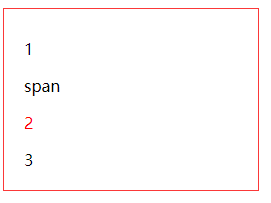

## css基础选择器
css选择器比较多，可以通过元素、id、类、属性、伪类、伪元素以及各种组合等方式。一些基础的选择器可以点击学习：
[css基础选择器](https://www.w3school.com.cn/css/css_selectors.asp)。下面讲css3的部分选择器。

## first-child
选择其父元素的第一个子元素
```html
<style>
    p:first-child {
        color: blue;
    }
    span:first-child {
        color: yellow;
    }
    p:last-child {
        color: red;
    }
</style>
...
<div>
    <p>1</p>
    <span>span</span>
    <p>2</p>
    <p>3</p>
</div>
```
效果：



1. **p:first-child**：父元素的第一个子元素是p，则样式生效。
2. **span:first-child**：父元素的第一个子元素不是span，则样式不作用。
3. **p:last-child**：父元素的最后一个子元素是p，则样式生效。

## :nth-child
选择其父元素下的第**n**个元素
```html
<style>
    p:nth-child(3) {
        color: red;
    }
</style>
...
<div>
    <p>1</p>
    <span>span</span>
    <p>2</p>
    <p>3</p>
</div>
```
效果：


**p:nth-child(3)**：选择p的父元素下的第3个元素，且要是p元素
**nth-last-child**：从后开始选择

1. **nth-child(n)**：**n**可以使用公式

```html
<style>
    p:nth-child(n+2) {
        color: orange;
    }
</style>
...
<div>
    <p>1</p>
    <p>2</p>
    <span>span</span>
    <p>3</p>
</div>
```
效果：


**p:nth-child(n+2)**：n从0开始，即选择2、3、4...。这里2、3中间有个**span**，此处样式未作用于span

## :nth-of-type
选择某元素的父元素下的第**n**个同类型元素
```html
<style>
    p:nth-of-type(2) {
        color: green;
    }
</style>
...
<div>
    <p>1</p>
    <span>span</span>
    <p>2</p>
    <p>3</p>
</div>
```
效果：


1. **p:nth-of-type(2)**：选择div下的p元素中的第2个。
2. **nth-last-of-type**：从后开始选择
3. 区别：nth-child是先找到第n个元素，再判断元素是否是相同元素。nth-of-type先找到所以的相同元素，再选择其中第n个

## :only-child
:only-child 选择器匹配属于父元素中唯一子元素的元素,
```html
<style>
    a:only-child {
        color: red;
    }
</style>
...
<div>
    <a>a</a>
</div>
```
**a**的父元素下仅有**a**，此时样式才作用

## :empty
选择不包含任何子元素、文本的元素
```html
<style>
span {
    display: inline-block;
    width: 10px;
    height: 10px;
}
span:empty {
    background-color: red;
}
</style>
...
<span>a</span>
<span></span>
```
效果：


## :not(配置)
选择非配置的所有元素
```html
<style>
    p {
        color:#000000;
    }
    :not(p) {
        color:#ff0000;
    }
</style>
...
<div class="box">
    <p>1</p>
    <div>div</div>
    <span>span</span>
    <p>2</p>
</div>
```
效果：


**:not(p)**：选择非p元素的其他元素应用样式


